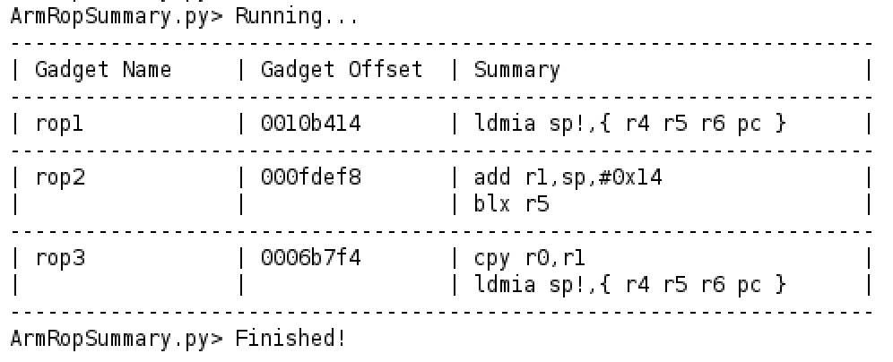
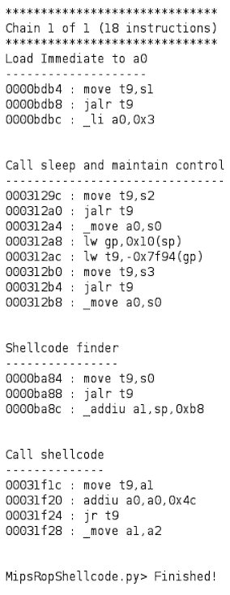

Port of IDA Plugins from [devttyS0](https://github.com/devttys0/ida) to 
Ghidra framework as well as new plugins. To install, clone and add the script 
directory via Ghidra's Script Manager. If you check the 'In Tool' checkbox they 
will appear under a 'TNS' tag. 

# Table Of Contents

## OG Scripts
[Call Chain](#call_chain) - Find call chains between two functions

[Codatify](#codatify) - Fix up code and data.

[Fluorescence](#fluorescence) - Highlight function calls.

[Function Profiler](#func_profiler) - Display cross refs from the current function.

[Leaf Blower](#leafblower) - Identify common POSIX functions.

[Local Cross References](#local_cross_ref) - Find references to items in the current function.

[MIPS Rop Finder](#mips_rop) - Find ROP gadgets in MIPS disassembly.

[Rename Variables](#rename_variables) - Rename saved stack variables.

[Rizzo](#rizzo) - Create fuzzy function signatures that can be applied to other projects.

## New Scripts
[ARM Rop Finder](#arm_rop) - Find ROP gadgets in ARM disassembly.

[MIPS Rop Finder](#mips_rop) Shellcode Chain - Build a ROP chain to call shellcode on MIPS systems.

[MIPS Rop Finder](#mips_rop) System Chain - Build a ROP chain to call system with a controllable string.

[MIPS Rop Finder](#mips_rop) Prologue Gadget - Find controllable gadgets at the beginning of functions that provide stack pointer movement.

[MIPS Rop Finder](#mips_rop) Epilogue Gadget - Find gadgets that grant control of more saved registers.

[Operator](#operator) - Identify calls to functions and the parameters that are provided to the function.

----

# ARM Rop Finder
Find ROP gadgets in ARM disassembly.

## ArmToThumb
Convert all executable disassembly to Thumb instructions to search for ROP gadgets.
The output of ROP gadets will account for Thumb instructions and display the jump 
address as `ADDRESS + 1 = WHERE_YOU_SHOULD_JUMP`. The operation can be undone 
when finished looking for gadgets.

### Before
ARM disassembly before running the Arm to Thumb plugin.

### After
Disassembly after the conversion.

### Thumb Gadget
Thumb gadgets are shown with their actual address, but when jumping to it from 
a ROP gadget you must jump to the address + 1 to switch to Thumb mode.

## Find
Find controllable gadgets that contain custom ARM instructions. Regular 
expressions are supported. To search for a move to r0 from anything, simply 
search for 
"`mov r0,.*`".

## Register Control
Find ARM ROP gadgets that give control of registers by popping them off the stack.

## Register Move
Find ARM ROP gadgets that move values between registers.

## Stack Finder
Find ARM ROP gadgets that put a stack address in a register. Useful for finding shell code and strings on the stack.

## Summary
Print a summary of gadgets that have been book marked with the string `ropX` 
where `X` is the gadgets position in the rop chain. Don't mix ARM And Thumb 
gadgets with the summary, it won't work. I will fix this.

## System
Find ARM ROP gadgets for calling system with a user controlled argument.

----

# Call Chain
Display the call chain, if it exists, between two functions. The output will 
be display using a modified graphviz library as well as Ghidra's console.

----

# Codatify

## Fixup Code 
Define all undefined data in the .text section as code and covert it to a 
function if applicable.

### Before

### After

## Fixup Data
Define uninitialized strings and pointers in the code. All other uninitialized
data is converted to a DWORD. Finally, search for function tables and rename
functions based off the discovered tables.

### Before 

**Data Section**

**Cross Reference**

### After

**Data Section**

**Cross Reference**

----

# Fluorescence
Highlight or un-highlight all function calls in the current binary.

----

# Function Profiler
Display all cross references from the current function. Will display all 
strings, functions, and labels. Depending on the size of the function, the 
console output size may need to be adjusted to view all the text.

----

# Leaf Blower 
Identify common POSIX functions such as printf, sprintf, memcmp, strcpy, etc

## Identify Leaf Functions
Identify leaf functions such as strcpy, strlen, atoi, etc.

## Identify Format Parameter Functions
Identify funtions that accept format parameters to identify sprintf, printf, fscanf, etc.

----

# Local Cross References
Find references to the selected item in the current function.

----

# Operator
Identify calls and the parameters provided to the function when called. The 
script will take into account variadic arguments if they can be identified, 
however, passing argument via the stack will not.

----

# MIPS ROP Gadget Finder
Find ROP gadgets in MIPS disassembly. 

## Double Jumps
Search for gadgets that contain double jumps.

## Epilogue
Find gadgets that give control of saved registers.

## Find
Find gadgets that contain custom MIPS instructions. Regular expressions are 
supported. To search for a move to a0 from anything, simply search for 
"`move a0,.*`".

## Indirect Return
Find indirect return gadgets. Call t9 and then return to ra.

## Li a0
Find gadgets that load a small value into a0. Useful for calling sleep.

## Prologue
Find controllable gadgets at the beginning of functions that provide stack pointer movement.

## Shellcode ROP Chain
Build rop chain to call shellcode. Chain is built off user intput and attempts
to build the shortest chain. Multiple chains can be requested if the first
is not suitable. If not enough registers are controlled a gadget to gain control
of more register will be used first in the chain.

- Avoid indirect returns
    - Avoid using gadgets that perform jumps to t9 in an epilogue but return to t9. Avoids stack movement.
- Avoid double jumps
    - Avoid gadgets that perform back to back jumps.
- Avoid gadgets that require a control jump
    - If a gadget jumps by controlling an 'a' or 'v' register a gadget will be added to get control of this register. Click this to avoid those types of gadgets.
- Do not reuse gadgets
    - Prevents some gadget reuse. Spices up the results a little bit, but you may not get the shortest chain.
- Verbose Output
    - Print all the outputs.

## System ROP Chain
Build rop chain to call system with a controllable string. Chain is built from
user input and attempts to build the shortest chain using multiple techniques.
Multiple chains can be requested. If not enough registers are controlled 
a gadget to gain control of more register will be used first in the chain.

## Stack Finder
Find gadgets that place a stack address in a register.

## Summary
Print a summary of gadgets that have been book marked with the string `ropX` 
where `X` is the gadgets position in the rop chain. Double jumps can be displayed
by appending `_d` to the `ropX` bookmark name: `ropX_d`.

## System Gadgets
Find gadgets suitable for calling system with user controlled arguments.

----

# Rename Variables
Rename saved stack variables for easier tracking. Only valid in MIPS.

----

# Rizzo

Create function signatures that can be shared amongst different projects. There
are multiple sets of signatures that are generated:

- Formal: Function matches entirely
- Fuzzy: Functions resemble each other in terms of data/call references.
- String: Functions contain same string references.
- Immediate: Functions match based on large immediate value references.

Formal signatures are applied first, followed by string, immediate, and fuzzy.
If a function is considered a match internal calls are also considered for 
renaming. 

## Apply
Apply Rizzo signatures from another project.

## Save
Save Rizzo signatures from the current project.

